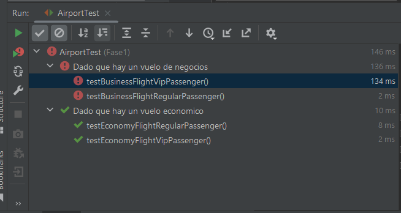
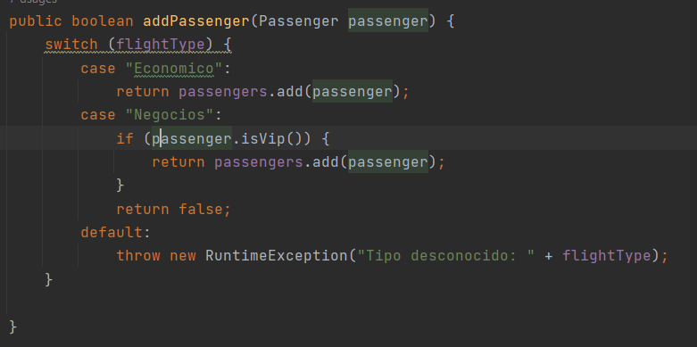
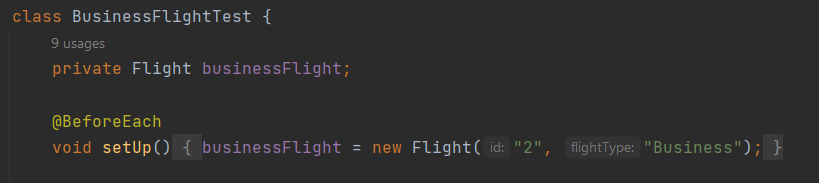

# Evaluacion2

**Ejecuta el programa y presenta los resultados y explica que sucede.**

Luego de ejecutar el programa, obtenemos el siguiente resultado:

```
Lista de pasajeros de vuelos de negocios:
Cesar
Lista de pasajeros de vuelos economicos:
Jessica
```

Se ejecutan ciertos escenarios posibles, pero las pruebas no son exhaustivas. Por ejemplo, tratar de añadir y remover un pasajero VIP de un vuelo de tipo económico.

## Preguntas 

1. Si ejecutamos las pruebas con cobertura desde IntelliJ IDEA, ¿cuales son los resultados que se muestran?, ¿Por qué crees que la cobertura del código no es del 100%?

    Los resultados obtenidos son los siguientes

    

    Podemos ver que las pruebas "Dado que hay un vuelo de negocios" fallan.

   Esto sucede porque para relizar las pruebas, existe una colisión de nombres en el atributo `flightType`

   Se comprueba si es de tipo "Negocios"

   

   Se instancia un objeto de tipo "Business"

   

2. ¿Por qué John tiene la necesidad de refactorizar la aplicación?

   Para evitar confundirnos en los nombres del tipo de vuelo, y verificar si existe ese error


3. ¿Por qué John tiene la necesidad de refactorizar la aplicación?

   Para evitar confundirnos en los nombres del tipo de vuelo, y verificar si existe ese error