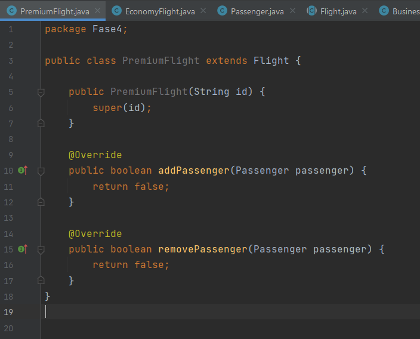

# Evaluacion2

---

*Ejecuta el programa y presenta los resultados y explica que sucede.*

Luego de ejecutar el programa, obtenemos el siguiente resultado:

```
Lista de pasajeros de vuelos de negocios:
Cesar
Lista de pasajeros de vuelos economicos:
Jessica
```

Se ejecutan ciertos escenarios posibles, pero las pruebas no son exhaustivas. Por ejemplo, tratar de añadir y remover un pasajero VIP de un vuelo de tipo económico.

---

1. Si ejecutamos las pruebas con cobertura desde IntelliJ IDEA, ¿cuales son los resultados que se muestran?, ¿Por qué crees que la cobertura del código no es del 100%?

    Los resultados obtenidos son los siguientes

    

    Podemos ver que las pruebas "Dado que hay un vuelo de negocios" fallan.

   Esto sucede porque para relizar las pruebas, existe una colisión de nombres en el atributo `flightType`

   En el método addPassenger(), se comprueba si es de tipo "Negocios"

   

   En la prueba, se instancia un objeto de tipo "Business"

   

---

2. ¿Por qué John tiene la necesidad de refactorizar la aplicación?

   El error en las pruebas que se cometió es muy sencillo de que pueda volver a pasar. Sobre todo, si se trabaja en un equipo, no todos sabrán que el `flightType` tiene que ser 'Negocios' y no 'Business'. Por lo que necesitamos refactorizar el código, para evitar que se de el mismo error en el futuro.

---

*Revisa la Fase 2 de la evaluación y realiza la ejecución del programa y analiza los resultados.*

Ahora podemos observar que todas las pruebas pasaron correctamente:


Por lo que la refactorización se realizó con éxito

---


3. La refactorización y los cambios de la API se propagan a las pruebas.
   Reescribe el archivo Airport Test de la carpeta Fase 3.

   La refactorización se realizó debido a que en el método de la fase 2 getPassengers() fue modificado a la fase 3 con el nombre de getPassengersList()

*Revise el método getPassengers() de la fase2.*
Fase2.png)

*Revise el método getPassengersList() de la fase3*
Fase3.png)

Ahora podemos observar que todas las pruebas pasaron correctamente:


---

4. ¿En qué consiste está regla relacionada a la refactorización?.

El código tiene que ser refactorizado para evitar la duplicación. La regla indica que si existen tres o más piezas de código similar
es considerado redundante y tiene que ser refactorizado en un nuevo procedimiento. Es válido tener dos piezas de código similar.

---

5. Escribe el diseño inicial de la clase llamada PremiumFlight y agrega a la
   Fase 4 en la carpeta producción.

Aquí está el diseño inicial de la clase llamada PremiumFlight, para poder instanciar 
un objeto en nuestro testingx



---

6. Ayuda a John e implementa las pruebas de acuerdo con la lógica comercial
   de vuelos premium de las figuras anteriores. Adjunta tu código en la parte que se indica en el código
   de la Fase 4. Después de escribir las pruebas, John las ejecuta.

Se implementaron las pruebas para la clase PremiumFlight y vemos que las pruebas fallan como es esperado


---
7.